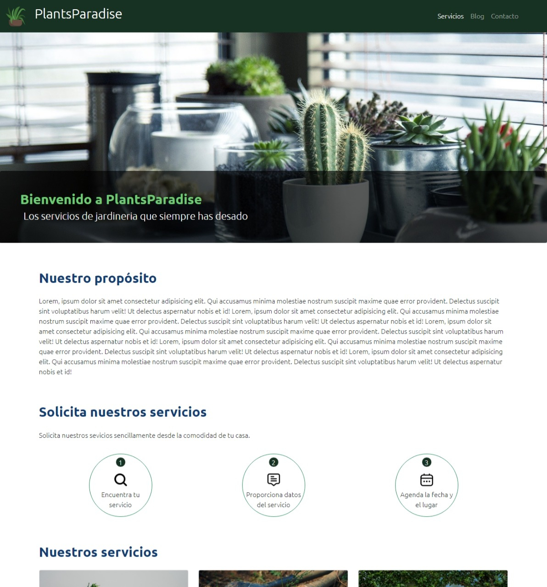
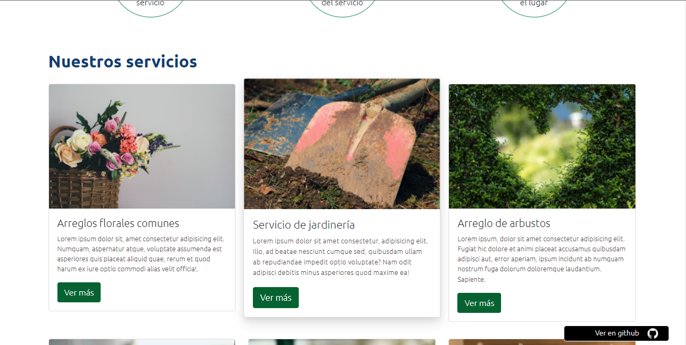
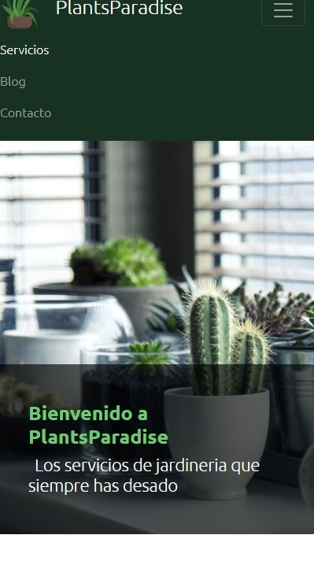

#  PlantsParadise

Plants paradise is a landing page of a gardening service built with Bootstrap 5 using responsive features and its source code.

The web page has a responsive nav bar and uses the Bootstrap grid system.

[Visit the website here](https://plantsparadise.netlify.app)

## Screenshots

  
  
  
